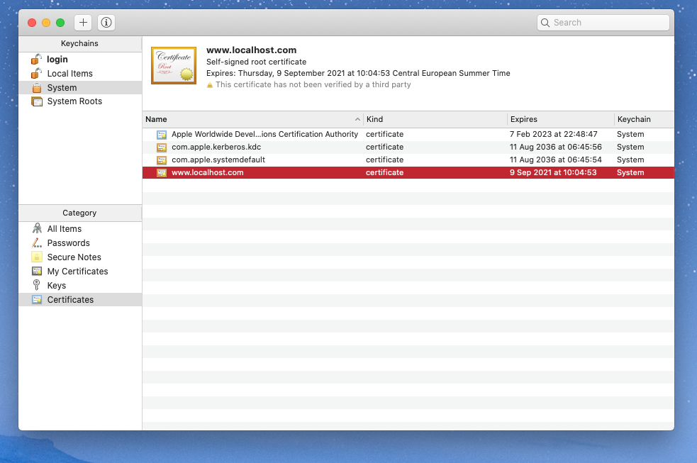

# Secure localhost 

This configuration helps to get `https` and `wss` (websockets) running on localhost.

### Create Certificates
- Go to directory ``security``
- Edit `req.cnf` 
- Create key and certificate with `openssl req -x509 -nodes -days 365 -newkey rsa:2048 -keyout cert.key -out cert.pem -config req.cnf -sha256`
- Done :-)

### Server
Start server with `node server.js`

### Browser
Start `https://localhost:3022/`
(for wws: `wss://localhost:3022/)`

- Works with firefox (with hosttech-chat-front)!

- For Chrome add the certificate (in security) to the System key chain.




## Using in a react client with Websocket library

```jsx
<Websocket
        ref={refWebSocket}
        url="wss://localhost:3022/"
        onOpen={handleOpen}
        onClose={handleClose}
        reconnect={true}
        debug={true}
        onMessage={(message) => {
          debugger;
          let uMessage = JSON.parse(message);
          let newMessages = [...messages, uMessage];
          setMessages(newMessages);
        }}
      />
```

## Reference
https://stackoverflow.com/questions/21397809/create-a-trusted-self-signed-ssl-cert-for-localhost-for-use-with-express-node)
